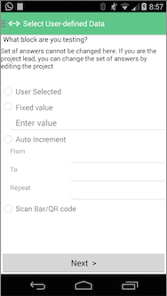
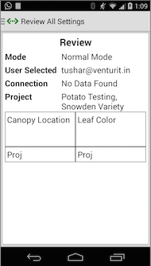
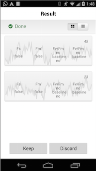
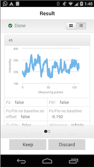

Photosynq Android App
=============

##### CREATING AN OPEN, GLOBAL DATABASE OF PLANT HEALTH
Researchers, educators, and citizen scientists use our low cost, hand-held measurement device to 
collect and share plant health data from anywhere in the world. 

## Screens

Download this application from [Google Play](https://play.google.com/store/apps/details?id=com.photosynq.app)

##Download and Import

### Setup
Download Android Studio
[here](https://developer.android.com/sdk/installing/studio.html)

###Android Studio/Gradle

 - download/clone repository and import Photosynq as project: `File -> Import Project` and select
 Photosynq directory.
 

##Third party libraries used in this app - 

 - GSon - GSon license [here](https://github.com/eatnumber1/google-gson/blob/master/LICENSE)
 - Picasso - Picasso license [here](https://github.com/square/picasso/blob/master/LICENSE.txt)
 - Zxing - Zxing core library license [here](https://github.com/embarkmobile/zxing-android-minimal/blob/master/COPYING)
 

